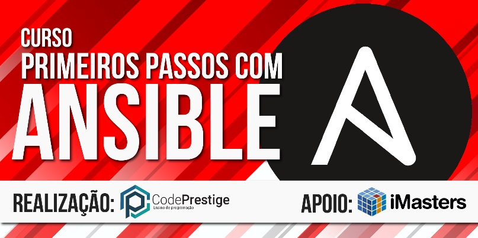

Curso presencial da Code Prestige - Primeiros passos com o Ansible
======================
Repositório oficial do curso: Primeiros passos com o Ansible - https://codeprestige.github.io/curso-primeirospassosansible/

Edições
------
| Código        | Data          | Link  |
| ------------- |:-------------:| -----:|
| ANSIBLE01     | 23/01/2017    | [aqui](https://www.eventbrite.com.br/e/curso-primeiros-passos-com-o-ansible-tickets-42200130727#) |

Descrição
------
Neste curso, aprenderemos como utilizar a tecnologia Ansible para automatizar tarefas. Veremos:

- Por que e pra que usar Ansible?
- A estrutura interna
- Estrutura básica de um projeto com Ansible
- Variáveis, templates e roles
- Hierarquia do projeto (escopo de execução)
- Playbooks, inventories
- Ansible.cfg
- E muito mais

O curso será dividido em duas partes de muito código prático. Em cada parte de 1 hora, o instrutor explicará os conceitos e os alunos serão desafiados a colocar esse conhecimento em prática logo em seguida. Ao final, um projeto de aprovação - com prazo de 1 semana para entrega - será proposto para que os alunos possam ganhar o certificado.

**Objetivo**
Capacitar o aluno a utilizar a tecnologia Ansible.

**A quem se destina**
Alunos e profissionais de TI de qualquer nível de experiência.

Instrutor
------
**Romulo Scampini**

Trabalha no desenvolvimento de software com Java e ecossistema JS. Tem grande experiência em DevOps utilizando ferramentas como Docker, Ansible e sistemas de virtualização. Formado em Sistemas de Informação pela FIAP.

[Site](http://http://www.scampini.com.br/) | [Twitter](https://twitter.com/romuloscampini)

Pré-requisitos
------
É muito importante que o aluno tenha instalado na máquina:

- Python (a partir da versão 2.7)
- Ansible (última versão - LTS)
- Editor de texto (Visual Code Studio, Sublime, Atom, Brackets, etc)

**ATENÇÃO**
Para facilitar, deixamos uma [VM de Ubuntu](https://1drv.ms/u/s!AsA38lgui-DqoIp-HN52aV8bkWfxwQ) com os requisitos já instalados, já que o Ansible depende da conexão SSH para o seu funcionamento.

Dados de acesso da VM:
 - Usuário: romuloscampini
 - Senha: 123456

**Configurações**
Não é necessária nenhuma configuração adicional.

**Conhecimento**
Para melhor aproveitamento do curso, recomendamos que o aluno tenha noções básicas de infraestrutura.

Caso você tenha algum problema ou dúvidas em relação aos pré-requisitos do curso, chegue **30 minutos** antes do início do curso para que possamos te auxiliar!

Obrigado!
------
Tendo algum dúvida, crítica, sugestão ou até mesmo encontrar um erro, não hesite em entrar em contato! Também fique a vontade para fazer um fork deste projeto.

**Curso: Primeiros passos com o Ansible** © 2018+, Code Prestige. Todos os direitos reservados.

> Site oficial [codeprestige.com.br](http://codeprestige.com.br) &nbsp;&middot;&nbsp;
> Twitter [@CodePrestige](https://twitter.com/CodePrestige) &nbsp;&middot;&nbsp;
> Facebook [/CodePrestigeBrasil](https://www.facebook.com/CodePrestigeBrasil/) &nbsp;&middot;&nbsp;